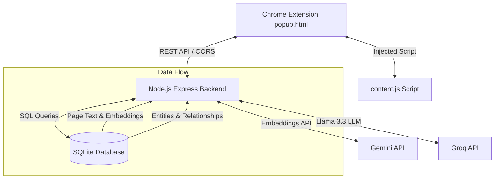

# MindMesh 🕸️

MindMesh is a premium, AI-powered Chrome Assistant designed to turn browser interactions into structured knowledge. It extracts, relates, visualizes, and secures web information on the fly. By integrating webpage summarization, semantic RAG search, phishing scam heuristics, privacy data scanning, and a multi-hop knowledge graph, MindMesh creates a persistent, interactive memory of your web browsing history.

---

## 🏗️ Architecture



### Components
1. **Chrome Extension popup.html/js**: Serves as the dashboard theme (Modern Slate) featuring vis-network visualizations powered by **Cytoscape.js**.
2. **Node.js Express Backend**: Hosts the API layer, coordinates LLM services, runs page chunking, security heuristics, and graph traversal algorithms.
3. **SQLite3 Database**: Persists pages, chunks, chunk vector embeddings (as BLOB vectors), and the relational entities-relationships graph structure.
4. **AI Providers**: Utilizes Groq for super-fast text synthesis and entity relationship extraction, and Gemini for text embeddings.

---

## ✨ Features

- **📝 Page Summarization & Chat**: High-quality webpage synthesis with Groq, and direct context-specific Q&A on active tabs.
- **🧠 Semantic Memory (RAG)**: Chunks, embeds (3072-dimension vectors), and indexes pages in SQLite, providing cross-page memory query capabilities.
- **🛡️ Scam Detection**: Combined regex heuristics (lookalikes, suspicious forms, hidden content) and AI verification to flag malicious URLs and phishing scams.
- **🔒 Privacy Intelligence**: Scrapes tracking pixels, extracts cookies/trackers, fetches privacy policies, and highlights critical data sharing practices.
- **🕸️ Knowledge Graph Engine**:
  - *Auto-Extraction*: Automatically extracts entities (Company, Technology, Person, Product) and relationships during page saving.
  - *Multi-Hop Traversal*: Traverses relationships using Breadth-First Search (BFS) to identify connections.
  - *Canvas Visualizer*: Dynamic, draggable node graph rendering inside the extension using Cytoscape.js.
  - *Provenance Traceability*: Clicking edges reveals the source page URL and confidence score.
  - *Hybrid QA*: Combines graph paths with vector chunk context to answer deep relational queries.

---

## 🛠️ Tech Stack

- **Frontend**: HTML5, Vanilla CSS3 (Slate theme), Javascript (ES6), [Cytoscape.js](https://js.cytoscape.org/)
- **Backend**: Node.js, Express, Axios, Cheerio (for policy scraping)
- **Database**: SQLite3
- **AI Models**: Groq Cloud SDK (Llama 3.3 70B), Google GenAI SDK (Gemini embeddings-001)

---

## 🚀 Installation & Setup

### 1. Prerequisites
- [Node.js](https://nodejs.org/) (v16+) installed.
- Google Chrome browser.

### 2. Configure Backend Env
Create a `.env` file in the `backend/` folder:
```env
GEMINI_API_KEY=your_gemini_api_key
GROQ_API_KEY=your_groq_api_key
GROQ_MODEL=llama-3.3-70b-versatile
AI_PROVIDER=groq
```

### 3. Install & Start Backend
```bash
cd backend
npm install
npm start
```
The backend will boot up at `http://localhost:3000`.

### 4. Install the Chrome Extension
1. Open Google Chrome and navigate to `chrome://extensions/`.
2. Enable **Developer mode** (toggle in top-right corner).
3. Click **Load unpacked** (top-left).
4. Select the `extension` folder inside this project directory.

---

## 📸 Screenshots

Checkout the full gallery under `docs/screenshots/`:
- **Page Summarizer**: [Summary Card](docs/screenshots/popup_page_tab.png)
- **Semantic Search**: [Memory Interface](docs/screenshots/popup_memory_tab.png)
- **Scam Protection**: [Safety Analysis Report](docs/screenshots/popup_safety_tab.png)
- **Graph Dashboard**: [Cytoscape Layout & Analytics](docs/screenshots/popup_graph_tab.png)
- **Multi-Hop QA**: [Hybrid Graph Chat Answer](docs/screenshots/popup_graph_chat.png)

---

## 🎥 Demo Video

Watch the walkthrough on YouTube: [MindMesh Demo Video](https://youtube.com/) *(Placeholder - Replace with your recorded video link)*.

A full step-by-step recording guide is available in [docs/demo_script.md](docs/demo_script.md).

---

## 🔮 Future Improvements

1. **Local Embeddings**: Integrate Transformers.js for offline local embeddings.
2. **Real-time Traps**: Attach background service listeners to alert users immediately on entering lookalike domains.
3. **Graph Filtering**: Add filters in Cytoscape canvas to hide/show nodes by types (e.g. only view `Technology` or `Company`).
