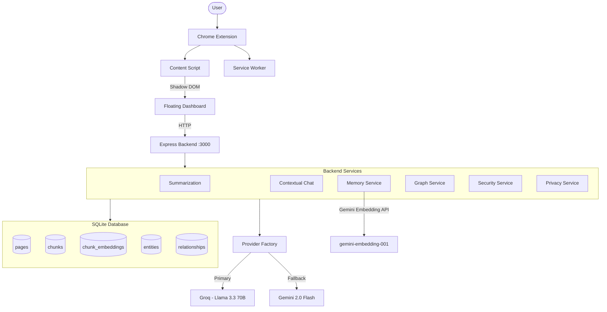
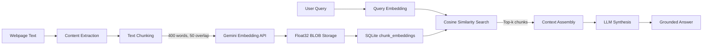
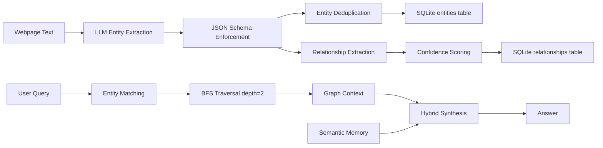
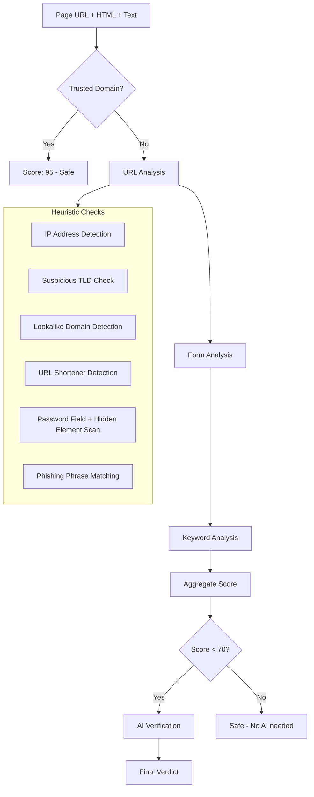
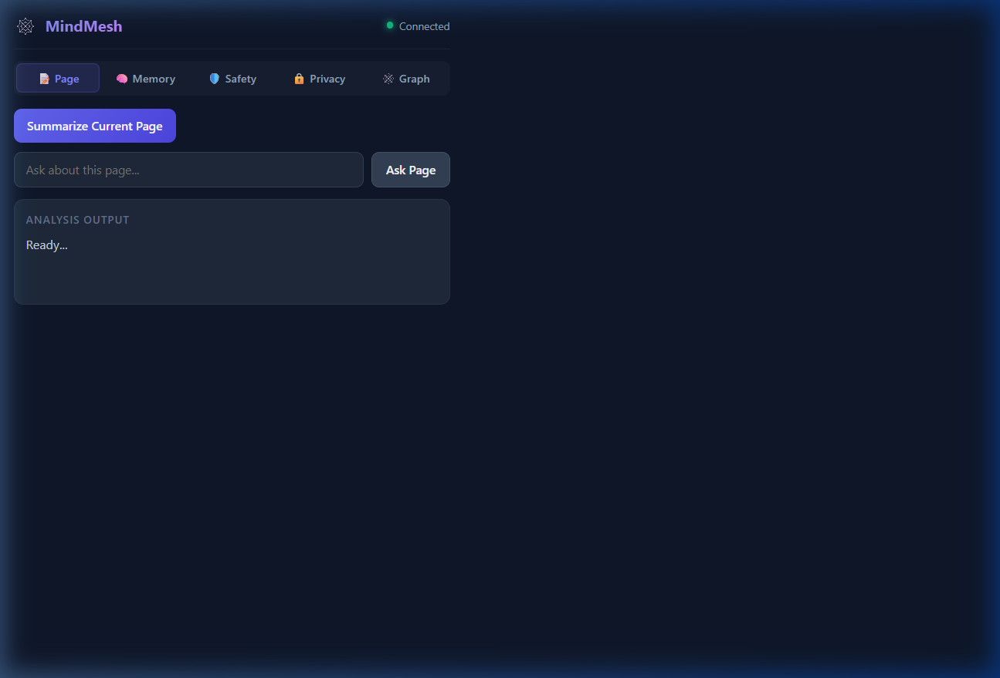
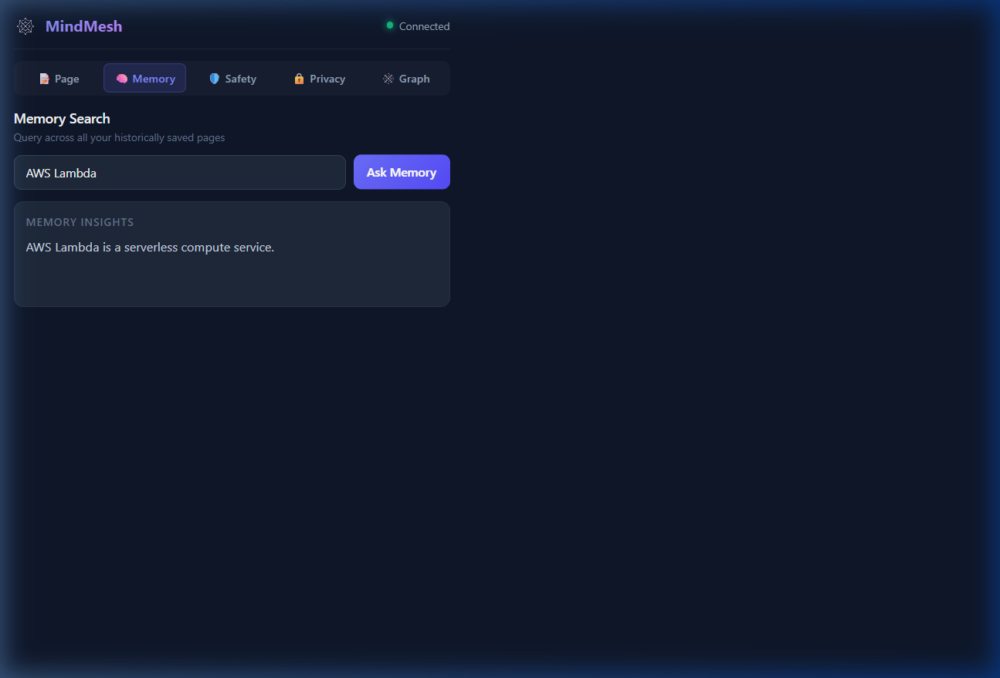
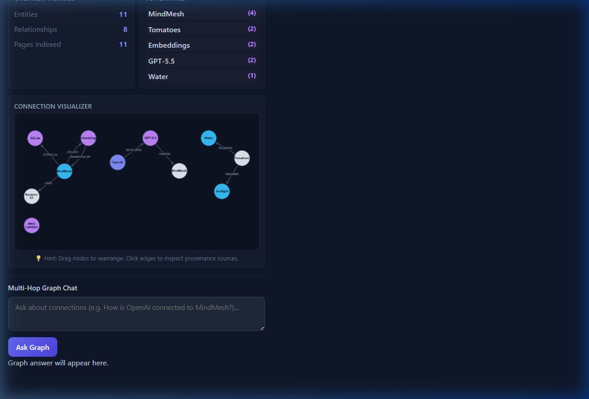
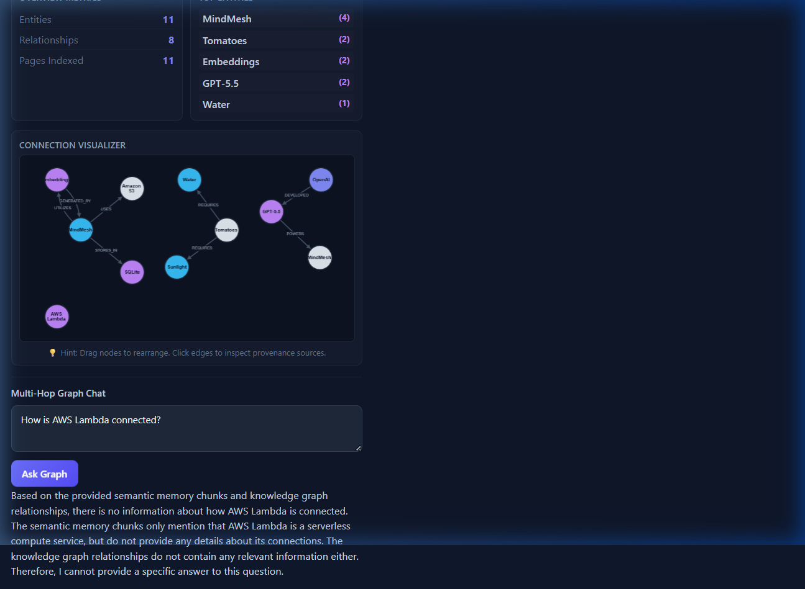

# MindMesh

An AI-driven browser extension that transforms passive web browsing into structured, searchable knowledge through retrieval-augmented generation, automated knowledge graph construction, and multi-layered web security analysis.

## Problem Statement

Users browse dozens of pages daily but retain almost nothing. Existing tools address this piecemeal: bookmarks save links but not knowledge, search history is keyword-dependent, and no browser-native mechanism connects concepts across separate browsing sessions. Meanwhile, users routinely visit pages with hidden trackers, deceptive forms, and phishing patterns with no inline warning.

MindMesh addresses these challenges by operating as a passive intelligence layer within the browser. It automatically extracts, vectorizes, and indexes webpage content into a local semantic database, constructs a knowledge graph of entities and relationships, and evaluates page safety and privacy in real-time.

## Key Features

**Page Summarization** -- Generates concise, structured summaries of active webpage content using LLM synthesis.

**Contextual Page Chat** -- Enables natural language interrogation of the current page, with the document's full text serving as a strict context window to prevent hallucination.

**Semantic Memory (RAG Pipeline)** -- Indexes visited pages using vector embeddings. Users query their browsing history through semantic search rather than keyword matching. Retrieved chunks are fed into the LLM for grounded answer synthesis.

**Related Memory Discovery (Deja Browse)** -- Proactively surfaces previously visited pages when the current page shares high semantic similarity (above 90% cosine similarity threshold). Notifications include similarity score and time since last visit.

**Knowledge Graph** -- Extracts entities and relationships from indexed pages via LLM-based Named Entity Recognition. Stores graph data in SQLite with confidence scores. Supports BFS traversal for multi-hop relationship queries and provides edge-click provenance tracing to source pages.

**Hybrid Graph+Memory Chat** -- Answers questions by combining knowledge graph traversal results with semantic memory retrieval, enabling cross-source synthesis.

**Privacy Analysis** -- Scans page HTML for embedded trackers, data collection forms, and privacy policy links. Auto-discovers and fetches privacy policies. Generates AI-assisted privacy summaries.

**Scam and Phishing Detection** -- Two-phase analysis: heuristic scanning (URL patterns, lookalike domains, form structures, context-aware keyword scoring) followed by AI verification for flagged pages. Trusted domain allowlist prevents false positives on known-safe sites.

**Provider Fallback Architecture** -- Intelligent failover across AI endpoints (Groq primary, Gemini secondary) with structured error normalization for rate limits, quota exhaustion, network failures, and model decommissioning.

**Floating Shield Assistant UI** -- Content script injects a sidebar dashboard via Shadow DOM to prevent CSS collisions with host pages. State persists across navigation via sessionStorage.

## System Architecture


```mermaid
flowchart TD
    User([User]) --> Ext[Chrome Extension]
    Ext --> CS[Content Script]
    CS -->|Shadow DOM| Popup[Floating Dashboard]
    Ext --> BG[Service Worker]

    Popup -->|HTTP| Backend[Express Backend :3000]

    subgraph Backend_Services [Backend Services]
        direction TB
        Summ[Summarization]
        Chat[Contextual Chat]
        Mem[Memory Service]
        Graph[Graph Service]
        Sec[Security Service]
        Priv[Privacy Service]
    end

    Backend --> Backend_Services

    Backend_Services --> Factory[Provider Factory]
    Factory -->|Primary| Groq[Groq - Llama 3.3 70B]
    Factory -->|Fallback| Gemini[Gemini 2.0 Flash]

    subgraph Storage [SQLite Database]
        direction TB
        Pages[(pages)]
        Chunks[(chunks)]
        Embeddings[(chunk_embeddings)]
        Entities[(entities)]
        Relations[(relationships)]
    end

    Backend_Services --> Storage
    Mem -->|Gemini Embedding API| EmbAPI[gemini-embedding-001]
```

## RAG Pipeline


```mermaid
flowchart LR
    A[Webpage Text] --> B[Content Extraction]
    B --> C[Text Chunking]
    C -->|400 words, 50 overlap| D[Gemini Embedding API]
    D --> E[Float32 BLOB Storage]
    E --> F[SQLite chunk_embeddings]

    G[User Query] --> H[Query Embedding]
    H --> I[Cosine Similarity Search]
    F --> I
    I -->|Top-k chunks| J[Context Assembly]
    J --> K[LLM Synthesis]
    K --> L[Grounded Answer]
```

## Knowledge Graph Pipeline


```mermaid
flowchart LR
    A[Webpage Text] --> B[LLM Entity Extraction]
    B --> C[JSON Schema Enforcement]
    C --> D[Entity Deduplication]
    D --> E[SQLite entities table]

    C --> F[Relationship Extraction]
    F --> G[Confidence Scoring]
    G --> H[SQLite relationships table]

    I[User Query] --> J[Entity Matching]
    J --> K[BFS Traversal depth=2]
    K --> L[Graph Context]
    L --> M[Hybrid Synthesis]

    N[Semantic Memory] --> M
    M --> O[Answer]
```

## Safety Analysis Pipeline


```mermaid
flowchart TD
    A[Page URL + HTML + Text] --> B{Trusted Domain?}
    B -->|Yes| C[Score: 95 - Safe]
    B -->|No| D[URL Analysis]
    D --> E[Form Analysis]
    E --> F[Keyword Analysis]
    F --> G[Aggregate Score]
    G --> H{Score < 70?}
    H -->|Yes| I[AI Verification]
    I --> J[Final Verdict]
    H -->|No| K[Safe - No AI needed]

    subgraph Heuristics [Heuristic Checks]
        D1[IP Address Detection]
        D2[Suspicious TLD Check]
        D3[Lookalike Domain Detection]
        D4[URL Shortener Detection]
        D5[Password Field + Hidden Element Scan]
        D6[Phishing Phrase Matching]
    end

    D --> Heuristics
```

## Technical Design

**Content Extraction** -- The content script isolates primary text from the active page using `document.body.innerText`, stripping navigation, footers, and structural noise before transmitting to the backend.

**Embedding Generation** -- Text payloads are chunked into 400-word segments with 50-word overlap to preserve semantic continuity across chunk boundaries. Each chunk is processed through Gemini's `gemini-embedding-001` model. Resulting vectors are serialized as Float32Array BLOBs in SQLite.

**Semantic Search** -- User queries are embedded using the same model. Cosine similarity is computed in-process against all stored chunk embeddings. Top-k results are retrieved and assembled into a context window for LLM synthesis.

**Graph Generation** -- The LLM performs entity extraction and relationship identification with a strictly enforced JSON output schema. Entities are deduplicated by `(name, type)` uniqueness constraint. Relationships include confidence scores and page-level provenance via foreign keys.

**Security Analysis** -- A subtractive scoring model starts at 100 and deducts penalties for URL anomalies, form structures, and keyword patterns. Context awareness prevents false positives: login keywords are only penalized when password fields are present. Pages scoring below 70 are escalated to AI verification.

**Provider Failover** -- The `providerFactory` wraps every AI call in a fallback chain. If the primary provider (Groq) fails with a fallback-eligible error (rate limit, quota, network, model decommission), the request is transparently retried against the secondary provider (Gemini). Both providers expose an identical interface.

## Project Structure

```
mindmesh/
├── backend/
│   ├── routes/
│   │   ├── graphRoutes.js
│   │   ├── memoryRoutes.js
│   │   ├── privacyRoutes.js
│   │   └── securityRoutes.js
│   ├── services/
│   │   ├── graph/
│   │   │   ├── graphService.js
│   │   │   └── graphChatService.js
│   │   ├── memory/
│   │   │   ├── chunkerService.js
│   │   │   ├── db.js
│   │   │   ├── embeddingService.js
│   │   │   ├── memoryChatService.js
│   │   │   └── memoryService.js
│   │   ├── retrieval/
│   │   │   └── retrievalService.js
│   │   ├── geminiService.js
│   │   ├── groqService.js
│   │   ├── heuristicScanner.js
│   │   ├── providerFactory.js
│   │   ├── securityService.js
│   │   ├── privacyService.js
│   │   ├── trackerScanner.js
│   │   ├── dataCollectionScanner.js
│   │   ├── privacyDiscoveryService.js
│   │   ├── privacyFetchService.js
│   │   ├── privacyLinkRanker.js
│   │   └── privacyPolicyAnalyzer.js
│   ├── data/
│   ├── tests/
│   │   ├── testChunkEmbeddings.js
│   │   ├── testChunker.js
│   │   ├── testEmbedding.js
│   │   ├── testMemoryChat.js
│   │   ├── testSecurityService.js
│   │   └── testSemanticSearch.js
│   ├── server.js
│   ├── package.json
│   └── .env.example
├── extension/
    ├── icons/
    ├── background.js
    ├── content.js
    ├── manifest.json
    ├── popup.css
    ├── popup.html
    ├── popup.js
    └── cytoscape.min.js
└── scripts/
    ├── generate_icons.js
    └── generate_user_icons.js
```

## Installation

### Prerequisites

- Node.js v18 or higher
- Google Chrome
- API keys for Groq and Gemini

### Backend Setup

```bash
cd backend
npm install
cp .env.example .env
```

Add your API keys to the `.env` file:

```
PORT=3000
GROQ_API_KEY=your_groq_api_key
GEMINI_API_KEY=your_gemini_api_key
```

Start the server:

```bash
npm start
```

The backend will start on `http://localhost:3000`. Verify with:

```bash
curl http://localhost:3000/health
```

### Extension Setup

1. Open Google Chrome and navigate to `chrome://extensions/`.
2. Enable **Developer mode** in the top-right corner.
3. Click **Load unpacked** and select the `extension/` directory from this repository.
4. The MindMesh icon will appear in your browser toolbar.
5. Click the icon on any webpage to activate the floating assistant.

## Usage

1. **Summarize**: Navigate to any webpage. Click the MindMesh icon, then click "Summarize Page". The page is automatically indexed into semantic memory.
2. **Ask**: Type a question in the Page tab to interrogate the current document.
3. **Memory Search**: Switch to the Memory tab. Ask any question to query across all previously indexed pages using semantic search.
4. **Safety Check**: Switch to the Safety tab and click "Analyze Page Safety" to run heuristic and AI-based security analysis.
5. **Privacy Scan**: Switch to the Privacy tab and click "Analyze Privacy" to detect trackers and evaluate data collection practices.
6. **Knowledge Graph**: Switch to the Graph tab to view the entity-relationship network. Click any edge to trace its provenance. Use the graph chat to ask questions that combine graph traversal with memory retrieval.

## Screenshots

| Dashboard - Page Tab | Semantic Memory |
|:---:|:---:|
|  |  |

| Knowledge Graph | Graph Chat |
|:---:|:---:|
|  |  |

## Demo

A full demonstration script covering all features is available in [demo_script.md](demo_script.md).

## Tech Stack

| Layer | Technologies |
| :--- | :--- |
| **Frontend** | HTML, CSS, JavaScript, Chrome Extension API (Manifest V3), Cytoscape.js |
| **Backend** | Node.js, Express |
| **AI Providers** | Groq (Llama 3.3 70B), Gemini 2.0 Flash, Gemini Embedding API |
| **Database** | SQLite (vectors stored as Float32Array BLOBs) |
| **Graph Visualization** | Cytoscape.js with color-coded entity types |

## Challenges and Engineering Decisions

**RAG Chunking Strategy** -- Balancing chunk size against context retention required experimentation. Chunks that are too small lose inter-sentence meaning; chunks that are too large dilute retrieval precision. The final configuration uses 400-word chunks with 50-word overlap to preserve semantic continuity across boundaries.

**Vector Storage Without a Vector Database** -- Introducing PostgreSQL with pgvector or a managed service like Pinecone would have added deployment complexity disproportionate to the project's scope. Instead, embeddings are stored as raw Float32Array BLOBs in SQLite, with cosine similarity computed in-process. This keeps the entire system self-contained in a single database file.

**Provider Fallback Design** -- Early iterations encountered frequent rate limits when processing multiple pages in sequence. Rather than forcing users to wait, the system was restructured around a `withFallback` wrapper that transparently retries against a secondary provider. The error normalization layer classifies failures by type (rate limit, quota, network, model deprecation) to determine fallback eligibility.

**Entity Deduplication** -- Web pages describe the same entities with varying names and contexts. The LLM output is constrained to a strict JSON schema with typed entity categories. A `UNIQUE(name, type)` constraint in the database prevents duplicate nodes, and `INSERT OR IGNORE` ensures idempotent graph updates across re-indexed pages.

**Manifest V3 Constraints** -- Chrome's Manifest V3 severely restricts background script capabilities. Long-running processes and direct API calls cannot execute in the service worker. This forced all AI processing and database operations into the local Node.js backend, with the extension acting purely as a content extraction and UI layer.

**False Positive Reduction in Security Scanning** -- Early versions flagged every Wikipedia article about "phishing" as dangerous. The scanner was redesigned with context awareness: login keywords are only penalized when password input fields are present on the page. A trusted domain allowlist with subdomain matching provides an immediate bypass for known-safe sites.

## Future Work

- **Contradiction Radar** -- Automated detection of conflicting information across multiple saved sources.
- **Local Embeddings** -- Transition to ONNX-based local vector generation to eliminate external API dependencies for embedding.
- **Enhanced Graph Exploration** -- Advanced filtering, clustering, and dynamic node expansion in the Cytoscape visualization.
- **Improved Privacy Intelligence** -- Expansion of the tracker signature database and integration of real-time policy change detection.

## License

This project is licensed under the MIT License. See the [LICENSE](LICENSE) file for details.
